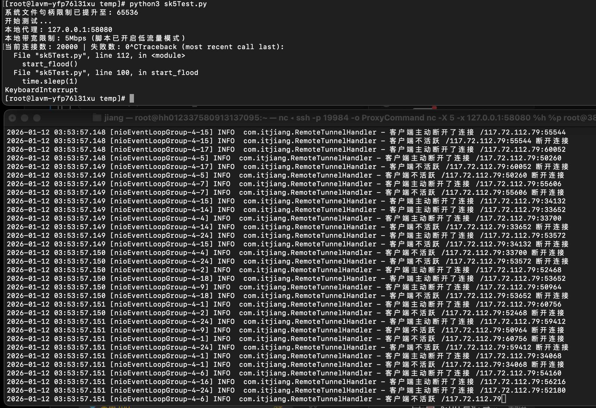

# SOCKS5 高性能安全代理

基于 **Netty + OpenSSL(BoringSSL)** 的高性能 SOCKS5/HTTP/HTTPS 代理通道，支持认证、流量统计、规则热更新与 GraalVM 原生镜像构建。

> 适用场景：开发调试、内网穿透中转、自建代理节点、需要低延迟和高并发转发的服务端到服务端链路。

## 目录

- [项目简介](#项目简介)
- [核心特性](#核心特性)
- [项目结构](#项目结构)
- [工作原理](#工作原理)
- [环境要求](#环境要求)
- [快速开始（5 分钟）](#快速开始5-分钟)
- [配置详解（proxy.properties）](#配置详解proxyproperties)
- [规则文件说明](#规则文件说明)
- [运行方式](#运行方式)
- [监控面板](#监控面板)
- [GraalVM 原生镜像](#graalvm-原生镜像)
- [常见问题（FAQ）](#常见问题faq)
- [开发与测试](#开发与测试)

---

## 项目简介

这是一个典型的 **Client / Server** 分离式代理系统：

- **Client**：部署在本地或边缘节点，对外提供 socks5/http/https 代理入口。
- **Server**：部署在公网或可达网络侧，负责接收 Client 的隧道请求并代为访问目标地址。
- **Common**：协议封装、配置加载、监控统计等共享逻辑。

Client 与 Server 之间通过 TLS 加密通道通信，并基于 Token 进行身份校验，降低明文转发和未授权接入风险。

## 核心特性

- **高并发低延迟**：基于 Netty 事件驱动模型，适合大量并发连接场景。
- **TLS 加密链路**：Client/Server 间数据加密传输。
- **多代理入口**：支持 SOCKS5、HTTP、HTTPS(CONNECT) 三种本地入口。
- **认证能力**：
  - Client -> Server：Token 认证。
  - Local App -> Client：可选 SOCKS5 用户名密码认证。
- **规则热更新**：
  - 直连放行规则（allow）支持热更新。
  - 目标拦截规则（block）支持热更新。
- **监控统计**：内置流量统计与 JSON 监控接口，支持历史持久化。
- **原生镜像**：支持 GraalVM Native Image 构建 Client 可执行文件。

## 项目结构

```text
socks5/
├── client/                      # 本地代理入口（socks5/http/https）
├── server/                      # 远端代理服务
├── common/                      # 公共配置、协议、监控等
├── test/                        # 压测/测试脚本
├── template-proxy.properties    # 配置模板
├── client-native-image-config-generate.sh
├── native-client.sh
├── README.md
└── README.en.md
```

## 工作原理

1. 本地应用连接 Client 提供的 socks5/http/https 端口。
2. Client 根据请求目标与规则文件判断：直连 / 拦截 / 转发。
3. 需要转发时，Client 使用 TLS 与 Server 建立加密隧道，并附带 Token。
4. Server 验证 Token 后，代表 Client 访问目标站点并回传数据。
5. 监控模块持续统计 in/out 字节数，并可通过监控端口查看。

## 环境要求

- **JDK 21**（`[21,22)`）
- **Maven 3.9+**
- **OpenSSL**（用于生成测试证书）
- **GraalVM + native-image**（可选，仅原生编译需要）

## 快速开始（5 分钟）

### 1）克隆与初始化配置

```bash
git clone https://gitee.com/j-jiang/socks5.git
cd socks5
cp template-proxy.properties proxy.properties
```

### 2）生成测试证书（自签名）

```bash
openssl genpkey -algorithm RSA -out server.key -pkeyopt rsa_keygen_bits:2048
openssl req -new -x509 -key server.key -out server.crt -days 3650 -subj "/CN=MyTunnelServer"
```

> 生产环境建议使用规范签发证书、妥善保管私钥并限制文件权限。

### 3）修改 `proxy.properties`

最小可用配置示例：

```properties
# client -> server 鉴权 token（单值）
client.auth.token=token-01

# server 允许 token 列表（逗号分隔）
server.auth.token.list=token-01,token-02

# server 监听（隧道）
server.port=8001

# client 连接的 server 地址
server.host=127.0.0.1

# TLS 证书/私钥
server.cert.path=server.crt
server.key.path=server.key

# 开启本地 socks5 入口
client.socks5.enabled=true
client.socks5.port=9090

# 可选 http/https 入口
client.http.enabled=true
client.http.port=9091
client.https.enabled=true
client.https.port=9092
```

### 4）构建

```bash
mvn clean package
```

### 5）启动 Server

```bash
java -jar server/target/server-1.0.1-jar-with-dependencies.jar
```

### 6）启动 Client

```bash
# 按 proxy.properties 一次性启动已启用服务（推荐）
java -jar client/target/client-1.0.1-jar-with-dependencies.jar

# 或仅启动单一模式
java -jar client/target/client-1.0.1-jar-with-dependencies.jar socks5
java -jar client/target/client-1.0.1-jar-with-dependencies.jar http
java -jar client/target/client-1.0.1-jar-with-dependencies.jar https
```

### 7）验证连通性

```bash
curl -x socks5h://127.0.0.1:9090 https://example.com -I
curl -x http://127.0.0.1:9091 https://example.com -I
curl -x http://127.0.0.1:9092 https://example.com -I
```

## 配置详解（proxy.properties）

可从 `template-proxy.properties` 拷贝并按需覆盖：

```properties
# client 鉴权 token（必须）
client.auth.token=token

# 本地代理入口开关
client.socks5.enabled=true
client.http.enabled=true
client.https.enabled=true

# 本地端口与 socks5 可选口令认证
client.socks5.port=9090
client.socks5.password.auth.enabled=false
client.socks5.username=admin
client.socks5.password=123456
client.http.port=9091
client.https.port=9092

# allow / block 规则文件（支持热更新）
client.direct.allow.path=./direct-allow.conf
client.block.path=./block.conf

# 远端 server 地址
server.host=127.0.0.1

# server 认证与证书
server.auth.token.list=token-01,token-02
server.key.path=server.key
server.cert.path=server.crt

# 隧道监听端口
server.port=8001

# 监控配置
server.stats.path=./stats.json
server.monitor.host=127.0.0.1
server.monitor.port=18080
```

配置注意事项：

- `client.auth.token` 必须存在，且应包含于 `server.auth.token.list` 中。
- `server.cert.path` 文件必须存在，否则程序会在启动阶段失败。
- 若开启 `client.socks5.password.auth.enabled=true`，则用户名和密码不能为空。
- `client.socks5.enabled/client.http.enabled/client.https.enabled` 至少开启一个。

## 规则文件说明

### 1）直连放行规则 `direct-allow.conf`

命中后请求不走远端代理，直接由本机访问。

匹配语法：

- 空行忽略
- `#` 开头为注释
- `*example.com`：后缀匹配
- `example*`：前缀匹配
- 其他：精确匹配

示例：

```text
# 直连域名
localhost
*.local
*internal.example.com
10.0.0.1
```

### 2）拦截规则 `block.conf`

命中后可直接拒绝目标访问（用于阻断特定域名/后缀）。

示例：

```text
ads.example.com
tracker.example.net
```

## 运行方式

### 方式 A：Java JAR（推荐开发/排障）

```bash
java -jar server/target/server-1.0.1-jar-with-dependencies.jar
java -jar client/target/client-1.0.1-jar-with-dependencies.jar
```

### 方式 B：显式指定配置文件

```bash
java -Dconfig=/path/to/proxy.properties -jar server/target/server-1.0.1-jar-with-dependencies.jar
java -Dconfig=/path/to/proxy.properties -jar client/target/client-1.0.1-jar-with-dependencies.jar
```

### 方式 C：Client 单模式启动

```bash
java -jar client/target/client-1.0.1-jar-with-dependencies.jar socks5
```

## 监控面板

服务端会启动监控 HTTP 服务：

- 地址：`http://server.monitor.host:server.monitor.port/`
- 默认：`http://127.0.0.1:18080/`
- 返回：JSON（全局 + 各 token 的流量统计）

安全特性：

- 仅允许内网/本地来源访问（含 loopback/site-local/link-local 等）。
- 建议继续配合防火墙策略，仅对可信网段开放。

## GraalVM 原生镜像

仅 Client 支持原生编译。

### 1）生成配置

```bash
sh client-native-image-config-generate.sh
```

> 该阶段会运行应用，请尽可能覆盖真实使用路径，以生成更完整的反射/资源配置。

### 2）构建原生可执行文件

```bash
sh native-client.sh
```

构建成功后可在 `client/target/` 下看到对应平台可执行文件。

### 3）运行

```bash
cd client/target
./client
```

## 常见问题（FAQ）

### Q1：启动时报 `server.cert.path 对应文件不存在`
请确认证书路径相对的是**当前启动目录**，或改成绝对路径。

### Q2：为什么 `https` 模式不需要中间人证书？
该模式基于 HTTP CONNECT 隧道转发，不解密目标站点 TLS 内容。

### Q3：Client 启动失败提示至少开启一个服务
检查 `client.socks5.enabled/client.http.enabled/client.https.enabled`，至少有一项为 `true`。

### Q4：如何排查 Netty 内存泄漏？
启动参数增加：

```bash
-Dio.netty.leakDetection.level=PARANOID
```

## 压测方案（Server / Client+Server 全方位）

建议按 **分层压测** 执行，避免一次性混测导致定位困难。

### 一、压测目标与维度

- **Server-only**：仅压 `server` 的 TLS 接入、鉴权、隧道转发能力。
- **Client+Server**：压完整链路（本地代理入口 -> Client -> Server -> 目标站点）。
- 关注指标：成功率、QPS、平均/尾延迟、上下行吞吐、连接建立失败率、资源占用（CPU/内存/FD）。

### 二、推荐执行步骤

1. **基线测试（低并发）**：先验证配置和证书是否正确。
2. **阶梯加压（10/50/100/200...）**：逐步提高并发和请求量，记录拐点。
3. **稳态压测（30~60 分钟）**：观察长期稳定性、连接泄漏、吞吐波动。
4. **故障注入**：目标站抖动/超时、断网重连、token 错误，验证系统恢复能力。

### 三、脚本清单（新增）

- `test/src/test/py/server_benchmark.py`
  - 模式 `auth`：Server 握手+鉴权压测。
  - 模式 `tunnel-echo`：Server 隧道数据转发压测。
- `test/src/test/py/tcp_echo_server.py`
  - 本地回显服务，供 `tunnel-echo` 模式使用。
- `test/src/test/py/client_server_benchmark.py`
  - 经 socks5/http 入口压测完整 Client+Server 链路（支持 HTTPS URL）。

### 四、实操示例

1）安装依赖：

```bash
pip3 install PySocks
```

2）Server-only：鉴权吞吐（不含目标转发）

```bash
python3 test/src/test/py/server_benchmark.py   --mode auth   --server-host 127.0.0.1 --server-port 8001   --token token-01   --threads 100 --iterations 200   --insecure
```

3）Server-only：隧道转发能力（配合本地 echo）

```bash
# 终端A：启动回显目标
python3 test/src/test/py/tcp_echo_server.py --host 0.0.0.0 --port 9000

# 终端B：压 server 隧道
python3 test/src/test/py/server_benchmark.py   --mode tunnel-echo   --server-host 127.0.0.1 --server-port 8001   --token token-01 --target-host 127.0.0.1 --target-port 9000   --threads 50 --iterations 100 --messages-per-conn 20   --payload-bytes 2048 --expect-echo --insecure
```

4）Client+Server：完整链路压测（SOCKS5）

```bash
python3 test/src/test/py/client_server_benchmark.py   --proxy-type socks5 --proxy-host 127.0.0.1 --proxy-port 9090   --url https://example.com/   --requests 2000 --concurrency 200 --timeout 10
```

5）Client+Server：完整链路压测（HTTP 代理入口）

```bash
python3 test/src/test/py/client_server_benchmark.py   --proxy-type http --proxy-host 127.0.0.1 --proxy-port 9091   --url https://example.com/   --requests 2000 --concurrency 200 --timeout 10
```

### 五、结果判定建议

- 成功率建议 >= 99.9%。
- 平均延迟随并发升高应平滑增长，出现突增时记录并发拐点。
- 长稳压测期间 `Monitor` 统计应持续增长且无异常回落。
- 若失败率升高，优先排查：FD 上限、端口范围、证书配置、目标站限流。

## 开发与测试

### 本地打包

```bash
mvn clean package
```

### 运行 Python 压测脚本

```bash
python3 test/src/test/py/socksTest.py
```

测试示例结果：



---

如果这个项目对你有帮助，欢迎 star / issue / PR。
